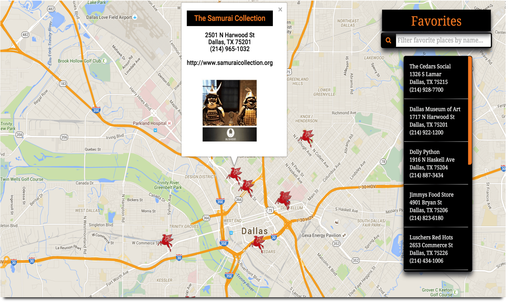
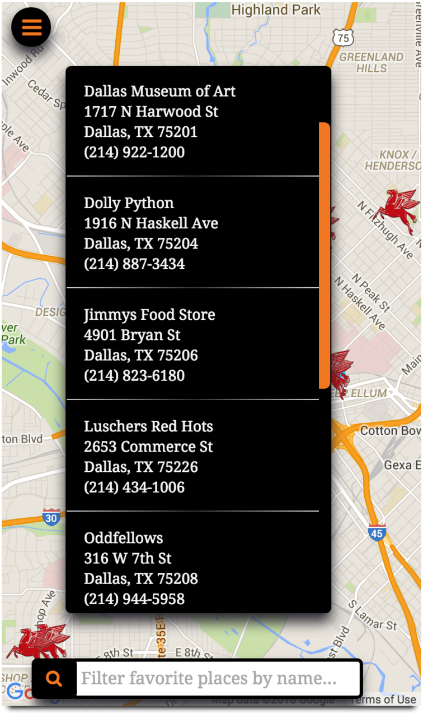

#[Neighborhood Map](http://samurairanderson.github.io/Neighborhood-Map/)

If you happen to be in Dallas and get a craving for some great food, a desire to peruse some eclectic shops, or would like to spend the day experiencing some amazing works of art, well, you're in luck because we have all of the above and this application will show you some great places.  

Neighborhood Map is a single page application that utilizes the Google Maps API, and Instagram's API, to showcase some fantastic locations in Dallas, TX.  Feel free to check out this application by clicking [**here**](http://samurairanderson.github.io/Neighborhood-Map/).

##Easy to use features

1) Click [**here**](http://samurairanderson.github.io/Neighborhood-Map/) to view a map of Dallas, TX. 
2) You can explore locations by either clicking a map marker _or_ clicking on the box titled "Favorites" to activate a dropdown of some of my favorite locations in Dallas. 
4) Once the dropdown menu is activated you can utilize the search box to filter through the names of my favorite locations. 
3) After clicking the the marker, or list, an infowindow will activate and show you contact info for the selected location and the latest picture posted from that location from Instagram. 
5) This application is responsive so the "Favorites" dropdown will collapse into a hamburger menu and it will render on the left hand side of the application, along with the search bar, when viewed on a mobile device.

##Technologies used for this project
<li>HTML5
<li>CSS3
<li>Javascript
<li>jQuery
<li>Knockout.js
<li>Google Maps API
<li>Instagram API
<li>Gulp

